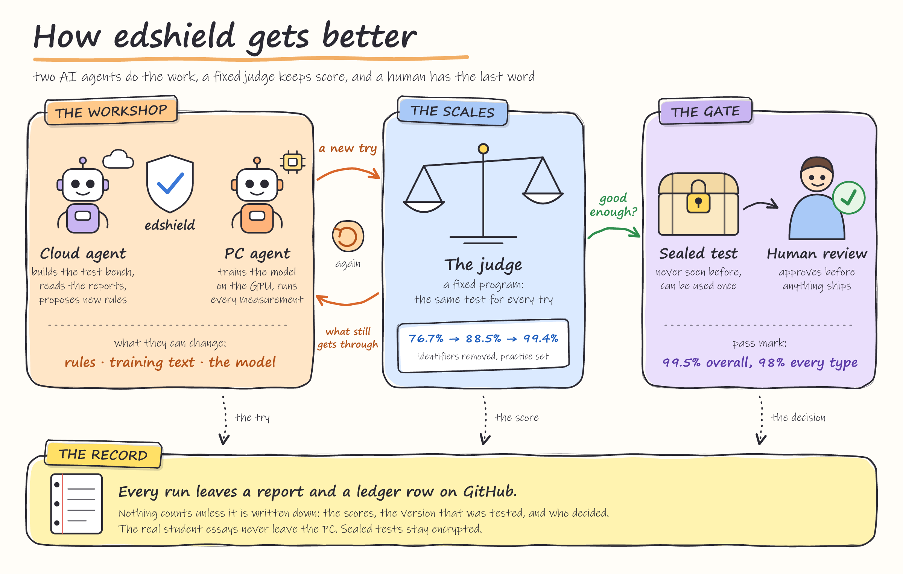

# edshield-evidence

The protected bench for [edshield](https://github.com/hemangnagar/edshield).
It runs the full `edshield.deidentify()` pipeline under a named policy and
runtime, measures what identifying text **survives in the final output**,
reduces the result to binary row views, and hands those to the
[model-evidence](https://github.com/hemangnagar/model-evidence) judge
(git submodule at `judge/`, tag `v2.0.0`) for a verdict. It also holds the
acceptance criteria, the sealed acceptance sets, and the experiment ledger.

System under test: `edshield==0.2.0` from PyPI (source commit `a568e73`).

<p align="center">
  <a href="docs/ARCHITECTURE.md"></a>
</p>

## What this repo is, and is not

**It is** the honest number. edshield's own evaluator scores the detector
(`analyze_text`) and counts a gold span as handled when any flag touches it.
Here an identifier counts as handled only when its normalized text no longer
occurs as a whole word in the de-identified text; a surname left behind after
the first name was masked is reported as a *partial residual*. The verdict
comes from the judge CLI against a committed policy file with a sha256.

**It is not** a certification. The wording rule for every output is:

> edshield X (detector, runtime) **meets / does not meet / has insufficient
> evidence for** defined redaction criteria on evidence set *S* (sha256 …)
> under policy *P* (fingerprint …).

The word "compliant" and the phrases "COPPA-compliant" / "FERPA-compliant" do
not appear in any report; a test scans `evidence/` and every `summary.md`,
and the report writer refuses to write a summary that contains them.

**It never** imports from edshield's `eval/`, reads or copies templates from
edshield's `eval/k12_bench.py` (a test shingles the draft generator against
the pinned copy), trains a model, holds real student text, or computes
pass/fail itself. Nothing here modifies edshield.

## Layout

```
edshield_evidence/
  residual.py        residual + word-level scoring on the final output        (CODEOWNERS)
  export_views.py    dataset + config -> model-evidence 2.0 bundle (+ diagnostics)
  datasets.py        PIILO holdout, k12_hard, sealed-set loaders; BIO -> char spans
  hashes.py          data / recipe / environment / model sha256
  runtimes.py        python and onnx runtimes behind one interface
  seal.py            seal / unseal acceptance sets (AES-256-GCM)
  ledger.py          append-only ledger; `pin` re-pins regression targets (human)
  policy.py          select one keyed judge policy; ratification status
  report.py          summary.md for a report directory
policies/
  regression.json    judge policies for the regression sets, keyed <dataset>/<detector>   PROVISIONAL
  acceptance.json    judge policies for sealed sets, keyed <detector> | parity           PROVISIONAL
scripts/
  baseline.sh        end-to-end: export -> judge -> summary -> ledger
  gen_k12_hard.sh    regenerate the k12_hard set from the pinned edshield commit
  gen_acceptance_draft.py   A<n> draft generator (own templates) for human review
evidence/
  sets/              k12_hard_seed1.jsonl (+ .sha256, manifest); A1.draft.jsonl + A1.draft.review.md;
                     sealed sets as A<n>.jsonl.enc, A<n>.sha256, A<n>.manifest.json
  reports/<date>-<short-hash>/   <step>.bundle.json, .policy.json, .verdict.json, .diagnostics.json, summary.md
  ledger.md
judge/               git submodule -> model-evidence v2.0.0
docs/LOOP.md         the bounded experiment loop and the agent-role boundaries
docs/ARCHITECTURE.md diagrams: the two agents, the judge, the data flow, what is automated
.github/workflows/   regression.yml (pull_request), acceptance.yml (workflow_dispatch)
```

## Install

```bash
git clone --recurse-submodules https://github.com/hemangnagar/edshield-evidence
cd edshield-evidence
python -m pip install -e ".[dev]"          # rules-only runs, tests
python -m pip install -e ".[dev,hf]"       # + the python runtime with the model (torch, transformers)
python -m pip install -e ".[dev,hf,onnx]"  # + the onnx runtime
pytest -q
```

Python 3.10+, Node 22+ (the judge CLI uses Node built-ins only). The model
weights are on the Hugging Face Hub under the `edshield` org; set
`EDSHIELD_ALLOW_DOWNLOAD=1` on the first run (edshield downloads nothing
unless told to), or point `--model-dir` / `--onnx-dir` at local copies.

## Datasets and their roles

| dataset | where | role | why |
|---|---|---|---|
| `piilo_holdout` | local only: `EDSHIELD_EVIDENCE_PIILO=<dir with validation.json>` (the 680-document split edshield reports on) | regression | it was used to choose the INT8 `keep2` export, so it cannot serve acceptance |
| `k12_hard` | `evidence/sets/k12_hard_seed1.jsonl`, generated once by `scripts/gen_k12_hard.sh` from edshield's generator at the pinned commit (`--style hard --n 400 --seed 1`) | regression, dev-visible | child-style text, every label |
| `sealed:A1`, `A2`, … | `evidence/sets/A<n>.jsonl.enc` | acceptance, one decision each | the only measurement nobody tuned against |

Every loader yields `(doc_id, text, gold_spans)` with spans as
`(start, end, label)` in character offsets. PIILO spans are rebuilt from the
BIO token labels here.

## Views

| view | rows | y_true | y_pred = 1 when | gate |
|---|---|---|---|---|
| `identifier` | one per gold span, cluster = document | 1 | the normalized gold string no longer occurs whole in the output | recall |
| `document` | one per document with a gold span | 1 | no gold span of the document survives whole | recall |
| `word` | one per whitespace token, cluster = document | token overlaps a gold span | the token was replaced or removed | fpr (over-redaction), precision |
| `type:<LABEL>` | identifier rows of that label | 1 | as `identifier` | recall per type |

Normalization is NFKC + casefold + collapsed whitespace with an offset map.
Gold strings that carry punctuation (phones, e-mails) are also matched after
stripping everything but letters and digits from both sides, still on word
boundaries, so `415-555-0199` is found in `4155550199`. **Known conservative
bias:** a surrogate that happens to equal a gold string (method `replace`)
counts as a residual; the judge cannot know it is a surrogate, and neither
can a reader.

Reported but not gated, in `<step>.diagnostics.json` and `summary.md`: the
partial residual per gold span (longest surviving token of ≥ 3 characters),
the label-confusion table (which acted-on labels touched each gold span), and
an over-redaction sample (up to 50 removed tokens outside any gold span with
±40 characters of context). For a sealed set the diagnostics hold counts only.

## Run the baseline

```bash
export EDSHIELD_EVIDENCE_PIILO=/path/to/piilo_hf_v2     # holds validation.json
export EDSHIELD_ALLOW_DOWNLOAD=1
scripts/baseline.sh                      # steps 1-4, policy coppa
scripts/baseline.sh --steps "3 4"        # k12_hard only
```

Steps, all under policy `coppa`, seeds `0 1 2` plus an exact `seed-0` rerun
(so the judge has a reproducibility group):

1. `piilo_holdout` × rules+model × python
2. `piilo_holdout` × rules+model × python,onnx — the parity run: two runs
   named `python` and `onnx` without seeds; the judge gates the `onnx` run and
   reports pairwise agreement; its stability and reproducibility axes are
   insufficient by construction
3. `k12_hard` × rules+model × python
4. `k12_hard` × rules only × python — the floor

Each step writes `evidence/reports/<date>-<short-hash>/<step>.{bundle,policy,verdict,diagnostics}.json`,
then `summary.md` (first line `criteria PROVISIONAL, not ratified` until a
`ratify:` commit touches the policy file) and one ledger row per step. Steps
1–2 are skipped with a note when `EDSHIELD_EVIDENCE_PIILO` is unset; step 3
fails loudly if the model cannot load (a silent fall-back to rules is an
error in this repo).

Report folders obey three conventions, all handled by the code:

- **Large bundles are split.** A PIILO bundle is about 140 MB and GitHub
  refuses files over 100 MB, so after judging `baseline.sh` runs
  `python -m edshield_evidence.bundles split <dir>`, which stores such a bundle
  as `<name>.part00`, `.part01`, … plus a `.sha256` of the whole. The report,
  ledger and policy modules read parts transparently;
  `python -m edshield_evidence.bundles join <dir>` rebuilds the whole file (for
  the judge CLI, which reads one file).
- **No real text in diagnostics.** For sealed sets and the PIILO holdout the
  diagnostics carry counts only (no partial-residual examples, no
  over-redaction contexts); k12_hard and other synthetic sets keep them.
  `--include-text` overrides, locally.
- **LF line endings everywhere** (`.gitattributes`), so a Windows checkout of
  `evidence/sets/k12_hard_seed1.jsonl` hashes to the pinned sha256 without any
  `core.autocrlf` setting. Hashes a report records are of the bytes on disk.

The first full baseline is `evidence/reports/2026-10-04-6c0f163/` (run on a
local machine with the PIILO holdout and the model; its README notes that its
step 1 bundle was split and its PIILO diagnostics stripped of text by hand,
before the code did either).

Measuring a candidate edshield (a checkout on a branch) instead of the pinned release:

```bash
pip install -e /path/to/edshield-checkout
EDSHIELD_SRC=/path/to/edshield-checkout scripts/baseline.sh --steps "1 3 4"
pip install edshield==0.2.0          # restore the pin afterwards
```

The report directory gets a `-cand-<sha>` suffix, the bundles and the ledger
row record the candidate's commit, and the judge compares it with the pinned
regression targets. `ledger pin` is still only run by a human, after a merge.

One step by hand:

```bash
python -m edshield_evidence.export_views --dataset k12_hard --policy coppa --detector rules \
    --runtime python --seeds 0 1 2 --repeat-seed 0 --out out/k12.bundle.json
python -m edshield_evidence.policy select policies/regression.json k12_hard/rules --bundle out/k12.bundle.json --out out/k12.policy.json
node judge/dist/run-evidence.mjs out/k12.bundle.json out/k12.policy.json --out out/k12.verdict.json
```

Exporter options: `--runtime python|onnx|python,onnx`, `--model`
(`piilo-deberta-v3-small-v2` is an alias of edshield's `piilo_deberta_small`),
`--model-dir`, `--model-dir-pattern models/ckpt-seed{seed}` (one checkpoint
per seed), `--onnx-dir` / `--onnx-file`, `--o-threshold`, `--limit`.

### The ONNX runtime

The installed package has no ONNX entry point. `runtimes.OnnxRuntime` swaps
`edshield.ner._predict` for an ONNX Runtime forward pass over
`onnx/model_quantized.onnx` (the demo's INT8 file with the first two encoder
layers at full precision) using the same tokenizer and config, and leaves
windowing, decoding, model authority, the rules and the policy application to
edshield. Those twenty lines duplicate what edshield's `eval/evaluate_onnx.py`
does; they are reimplemented here because this repo must not import from
edshield's `eval/`.

## Policies

`policies/regression.json` and `policies/acceptance.json` are each a map of
judge policy bundles keyed by `<dataset>/<detector>` (regression) or
`<detector>` / `parity` (acceptance), because the judge rejects a policy that
names a view the bundle lacks and the sets carry different labels and
targets. `policy select` copies one sub-bundle for the judge and drops
`type:*` entries for labels the bundle has no view for (printed, and recorded
in the summary); it never adds or relaxes a target.

- regression: must-not-worsen; `confidence: false`; targets are the pinned
  baseline rounded down. `k12_hard/rules` is pinned from the first run in
  this repo; `k12_hard/rules+model` and the PIILO word-fpr targets are
  **placeholders** until `python -m edshield_evidence.ledger pin` after the
  first local run with the model.
- acceptance: `confidence: true` (cluster-bootstrap intervals over documents
  must clear the target); identifier recall ≥ 0.995, document ≥ 0.99, each
  `type:*` ≥ 0.98 with `required: true` so an `n < 50` label shows as
  insufficient; word fpr ≤ 0.02 and precision ≥ 0.60; `minRuns` 5 for model
  changes, 3 for rules-only; parity: identifier recall on the onnx run ≥ 0.99
  and agreement ≥ 0.995 (reported by the judge, not gated).

The human ratifies by editing the file and committing with a message that
starts with `ratify:`. Until then every summary carries
`criteria PROVISIONAL, not ratified`.

## Seal a set

This repository is public, so a draft that is going to be sealed is
generated on a private machine with a private seed and is never committed
(drafts are git-ignored). A committed draft, or a committed seed with this
generator, would leave the "sealed" set readable in git history.

```bash
python scripts/gen_acceptance_draft.py A1 --n 400        # fresh private seed, printed once; -> evidence/sets/A1.draft.jsonl + A1.draft.review.md (both ignored by git)
# a human reviews A1.draft.review.md, edits A1.draft.jsonl, then:
export EDSHIELD_EVIDENCE_SEAL_KEY=$(python -m edshield_evidence.seal keygen)   # keep it in a password manager and as the repo secret
python -m edshield_evidence.seal seal A1 --from evidence/sets/A1.draft.jsonl --review-date 2026-10-05 --generator-version a-draft-3
```

Sealing writes `A1.sha256`, `A1.jsonl.enc` (AES-256-GCM, key from
`EDSHIELD_EVIDENCE_SEAL_KEY`) and `A1.manifest.json` (size, document count,
label counts, generator version, review date, `used_for_decision: null`),
then deletes the draft and its review file. Unsealing is done by the
acceptance workflow into the runner's temp directory and is never committed;
the exporter decrypts `sealed:A1` in memory. Once a verdict has been opened
for diagnosis, `seal mark-used A1 <report id>` records it and moves the set
to the regression role; draft `A2`.

No draft is kept in this repo. An early A1 draft (seed 11) was committed
before this rule and later removed; treat anything generated with that seed
as a practice set, never as an acceptance set.

## Ledger

`evidence/ledger.md`, append-only, one row per report step:
`date | report id | dataset | policy | detector | runtime | edshield commit | recipe sha | identifier recall [interval] | document recall | word fpr | verdict | note`.
`python -m edshield_evidence.ledger pin` re-pins the regression targets from
the latest row of each dataset/detector; a human runs it and commits the
diff, agents do not.

## CI and protections

- `regression.yml` on pull requests: judge self-check, `pytest`, exporter on
  `k12_hard` rules-only, judge against `policies/regression.json`; the job
  fails on any judge exit code other than 0 and uploads the report as an
  artifact. A second job runs rules+model when the repository variable
  `EDSHIELD_EVIDENCE_CI_MODEL=1` is set.
- `acceptance.yml` on `workflow_dispatch` (`set=A1`): needs the secret
  `EDSHIELD_EVIDENCE_SEAL_KEY`; unseals to the temp dir, runs exporter and
  judge with `policies/acceptance.json`, commits the report and the ledger
  row, sets `used_for_decision`, never commits unsealed data.
- `CODEOWNERS`: `policies/`, `evidence/sets/`, `edshield_evidence/residual.py`,
  `judge` → the human. Branch protection (require CODEOWNERS review on `main`)
  is set in GitHub by the human.

## Hashes in every bundle

`data_sha256` (the dataset file), `recipe_sha256` (edshield version, policy
fingerprint from `edshield.deid.policy_fingerprint`, sha256 of the installed
`edshield/rules.py`, detector, runtime, o_threshold, exporter version),
`environment_sha256` (Python, platform, pinned package versions) and, per
run, `model_sha256` (the weights file actually loaded; for rules-only runs
the installed `rules.py`).

## License

Apache-2.0. The judge submodule and edshield carry their own licenses.
