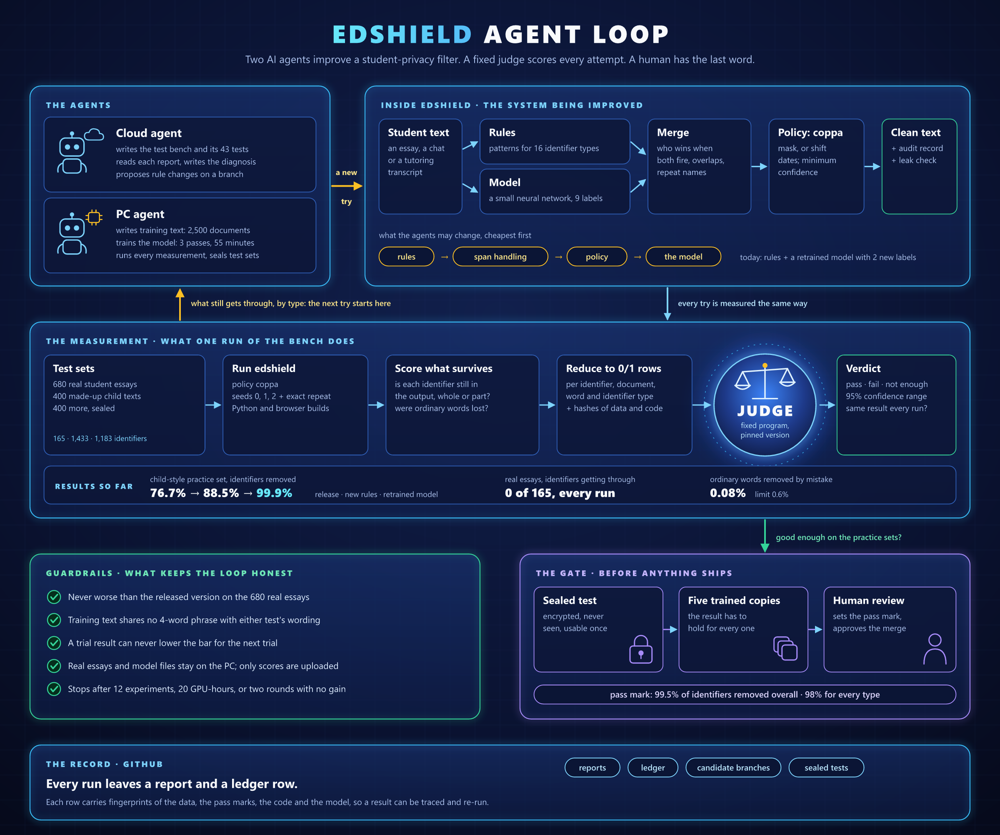
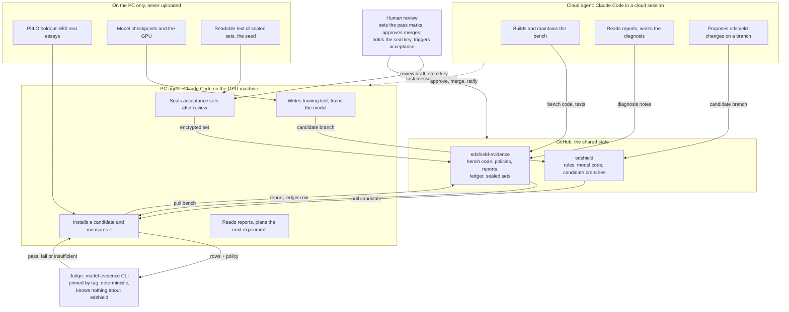
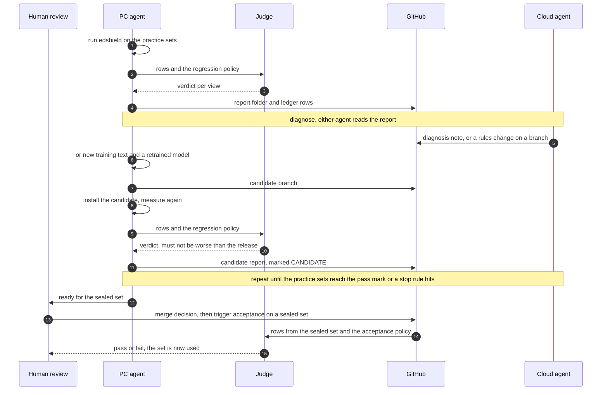
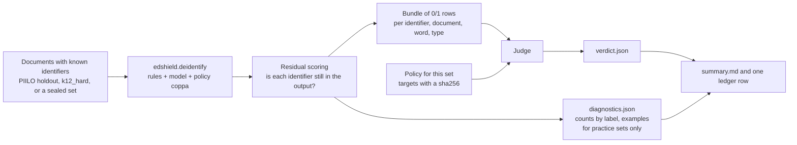

# How the agents, the bench and the judge fit together

State on 2026-10-05. This page shows who does what in the edshield improvement
loop, what moves between them, and which steps still need a person. The rules
each role works under are in [LOOP.md](LOOP.md).

Two Claude Code agents do the work. Neither decides whether edshield is good
enough: a pinned, task-blind judge does that from rows and a policy file, and
a human reviewer owns the pass marks, the sealed sets and every merge.

## 1. Who does what

## 2. One cycle of the loop

## 3. What happens inside one measurement

The scorer looks only at the final text edshield returns. An identifier counts
as handled when its text no longer occurs whole in the output, whatever label
edshield gave it.

## 4. What is automated and what is not

| Step | Who or what does it today |
|---|---|
| Run edshield on a set, score residuals, call the judge, write the report and ledger row | One script, `scripts/baseline.sh`, started by the PC agent |
| Pass or fail | The judge, from the rows and a policy file. No agent computes a verdict |
| Reading a report and choosing the next change | An agent (cloud or PC) |
| Rules changes, training text, model training | An agent, on a candidate branch |
| Measuring a candidate against the release | The PC agent, without asking |
| Uploading candidate branches and candidate reports | The PC agent, without asking, since 2026-10-05 |
| Handing work from the cloud agent to the PC | A one-way message. The PC agent answers through GitHub; there is no direct reply channel, so a person has carried replies by hand |
| Merging into edshield `main`, releasing | Human review |
| Reviewing a draft set, storing the seal key | Human review |
| Ratifying the pass marks (they are still PROVISIONAL) | Human review |
| Running acceptance on a sealed set | A human triggers it; each set can be used once |
| Starting cycles on a schedule with no session open | Not built. A cycle runs while an agent session is working |

## 5. Where the loop stands

| Measurement under policy `coppa` | Identifiers removed | Source |
|---|---|---|
| Release 0.2.0, PIILO holdout, rules + model | 165 of 165 | report `2026-10-04-6c0f163` |
| Release 0.2.0, k12_hard, rules + model | 1,099 of 1,433 (76.7%) | report `2026-10-04-6c0f163` |
| Candidate rules `c7be261`, PIILO holdout | 165 of 165, word false-alarm rate 0.08% | report `2026-10-05-f368ecb-cand-c7be261` |
| Candidate rules `c7be261`, k12_hard, rules + model | 1,268 of 1,433 (88.5%) | report `2026-10-05-f368ecb-cand-c7be261` |
| Model experiment 1 (learns town, school and street names), PIILO holdout | 165 of 165, word false-alarm rate 0.08% | report `2026-10-05-754e392-cand-928f50a` |
| Model experiment 1, k12_hard, rules + model | 1,425 of 1,433 (99.4%) | report `2026-10-05-754e392-cand-928f50a` |
| Model experiment 2 (adds names before 's), PIILO holdout | 165 of 165, word false-alarm rate 0.08% | report `2026-10-05-b145ba2-cand-3dc1431` |
| Model experiment 2, k12_hard, rules + model | 1,432 of 1,433 (99.9%), word false-alarm rate 0.23% | report `2026-10-05-b145ba2-cand-3dc1431` |
| Sealed set A1 | sealed 2026-10-05, not yet used | `evidence/sets/A1.manifest.json` |

The acceptance policy asks for 99.5% of identifiers removed overall and 98%
for every type, on a sealed set. The k12_hard gain from the candidate rules is
a check and not independent evidence, because those rules were shaped from
that set's misses. A pass on a sealed set shows that edshield meets these
redaction criteria on that set; it is not a legal finding about any law.
